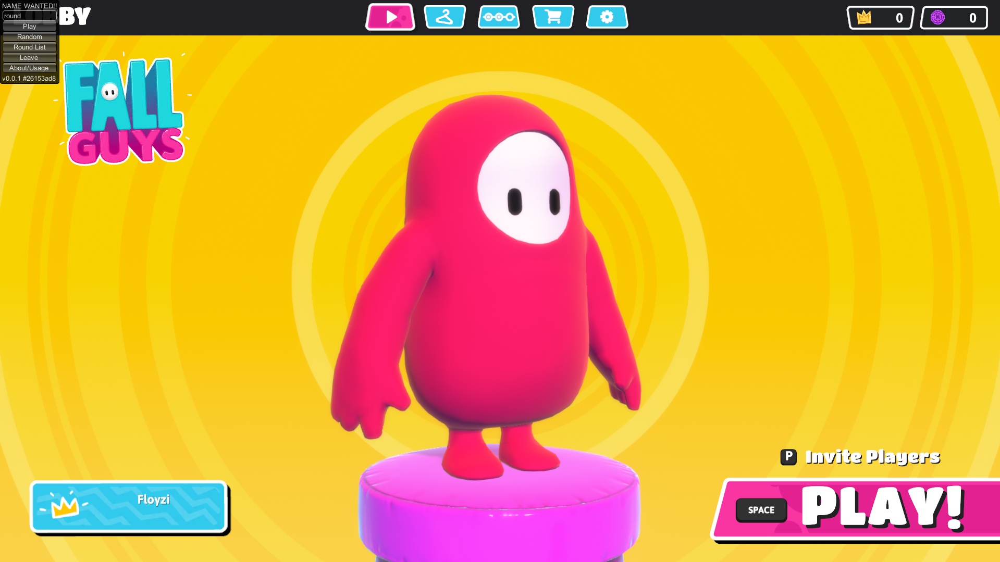
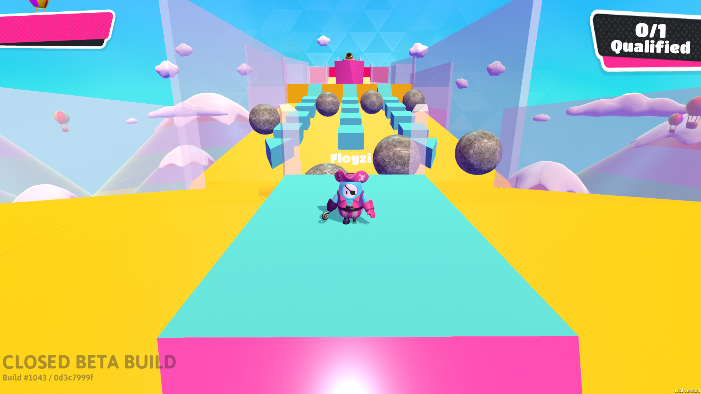
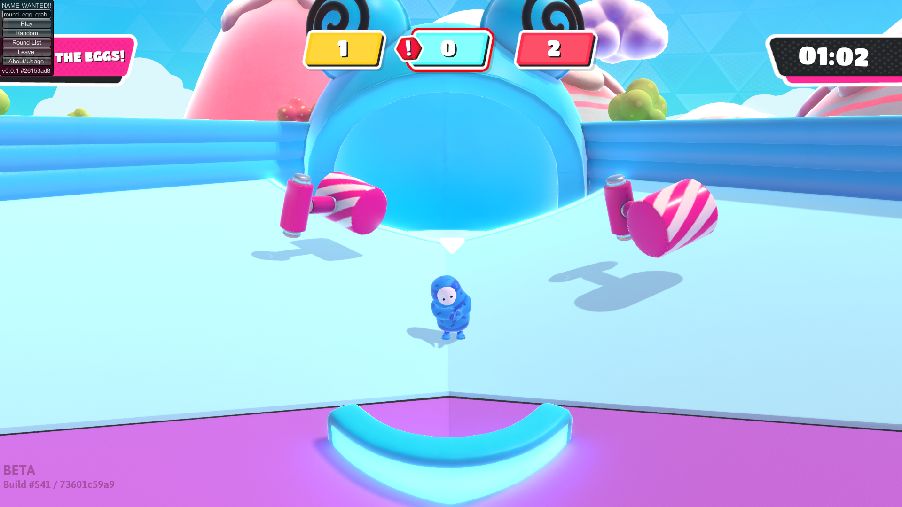

# Fall Guys — Legacy Tools
A small project that was made to bring life to the old Fall Guys betas\
Targets specifically following builds for now:
- April 27th, 2020
- April 30th, 2020
- May 13th, 2020
> [!NOTE]
> Work on newer builds is not guaranteed although in some cases it still may work

## Installation
- Get the needed build (can be found in [Fall Guys Builds Archive](https://floyzi.github.io/fg_archive/) or [Steam Depots](https://steamdb.info/depot/1265941/manifests/) if you own Fall Guys Technical Beta on steam)
- Download the [Latest Release](https://github.com/floyzi/FGLegacyTools/releases/latest) for this build
- Download [Goldberg Steam Emulator](https://mr_goldberg.gitlab.io/goldberg_emulator/)
- Copy steam_api64.dll from Goldberg Steam Emulator in ``FallGuys_client_Data\Plugins\x86_64``
> [!TIP]
> You don't need to use Goldberg Steam Emulator on April 27th, 2020 build
- Download some [BepInEx Bleeding Edge](https://builds.bepinex.dev/projects/bepinex_be) build for Unity IL2CPP ([this one](https://builds.bepinex.dev/projects/bepinex_be/733/BepInEx-Unity.IL2CPP-win-x64-6.0.0-be.733%2B995f049.zip) for example)
- Extract it into the build folder
- Put specific for build release .dll into the ``BepInEx\plugins`` folder (if plugins folder doesn't exist create one)
- Launch the game 

## Screenshots

## Building
- Add assemblies from needed build into the ``Lib/target_build`` folder. Assemblies will be generated by Il2cppInterop automatically after the first launch of the game with BepInEx, they can be found in ``BepInEx\interop``
- Select specific build in the configuration manager 
- Build the project, build results will be in the Release folder inside the project